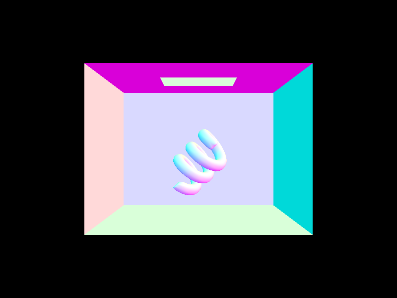
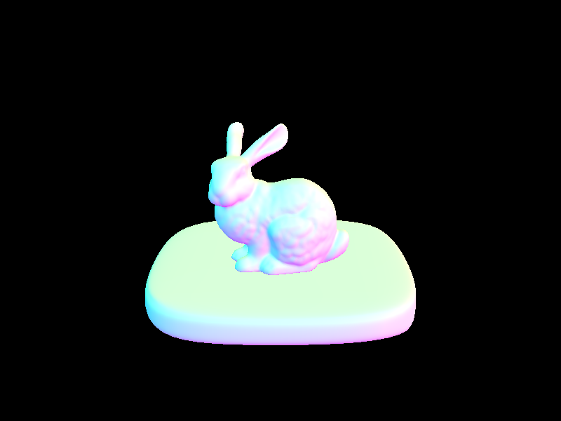
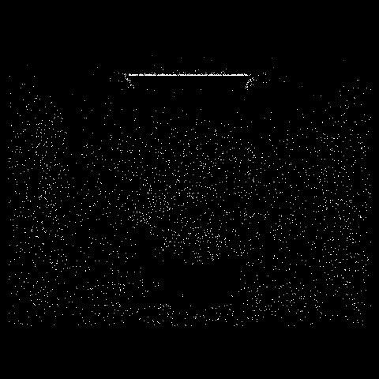
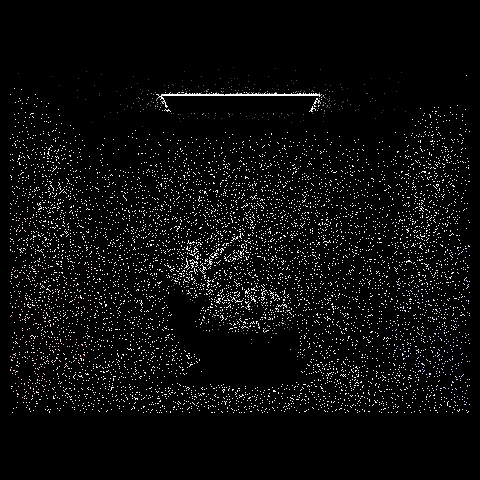
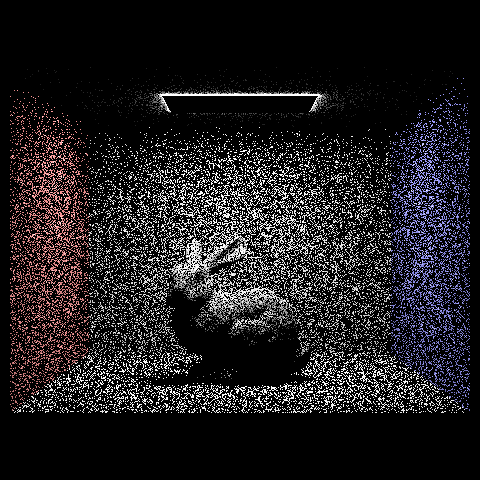
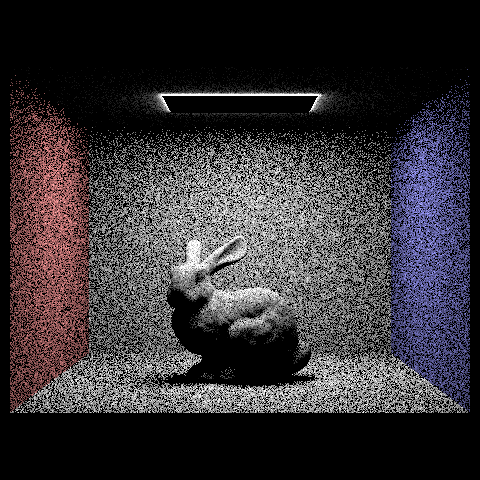
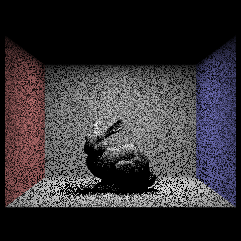
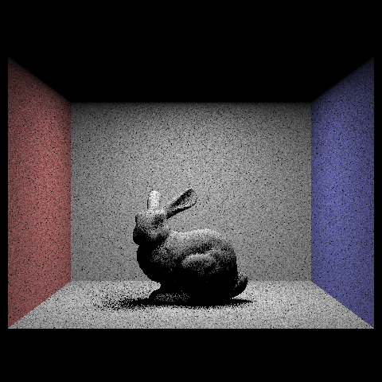
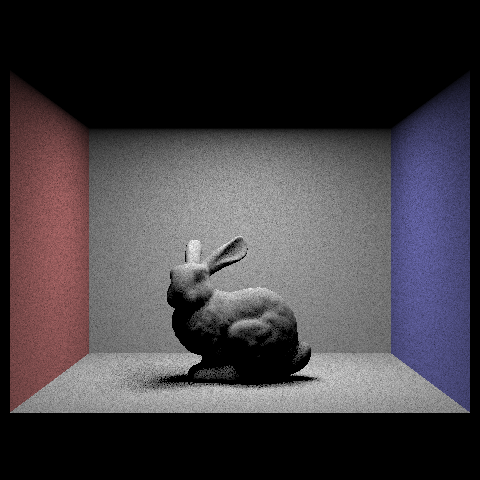

Assignment 3: PathTracer
====================
Fanyu Meng

## Overview
In this project, we implemented a crude path tracer that can render simple objects. By implementing the `Ray` class and `intersect` functions in some primitives, we allow the camera ray to trace a light path and return the result. Using that abstraction, we implemented direct and indirect illumination, allowing the camera to find the color of a pixel with one bounce or multiple bounces. 

We also include several optimization methods. The first one is to organize the primitives using a hierarchical tree of bounding boxes, which allow us to skip many intersection test if the ray is not intersecting with the box; the second optimization is to incorporating adaptive sampling, stop generating rays if the pixel have already likely converged. 

## Part 1: Ray Generation and Scene Intersection

The structure of the rendering pipeline is:
1. For each sample per pixel, convert the 2D pixel coordinate into 3D ray direction from the camera to the sample location on the imaging plane;
2. Using a radiance calculating method, find the radiance of the given ray. First we find the first intersection on the path of the ray. By scanning through all primitives or scanning in a hierarchical order, we update the intersection point on the line to the first intersection;
3. Using the material BRDF and the reflecting direction of the intersection point, find the illumination of the ray on the given intersection.

The triangle intersection algorithm is basically a barycentric-coordinates test. Using the direction of the ray and the normal vector of the triangle, we can find the hitting point of the ray on the plane of the triangle. By finding the barycentric-coordinates w.r.t. to the triangle, we can apply a `point_in_triangle` test and find the distance of the hitting point of the ray from the camera. We then check if the point is valid (e.g. hitting point is behind the camera) and update the valid region of the ray. 

    <table width="100%" align="middle">
        <tr>
            <td align="middle">
                
                <figcaption align="middle"><code>CBspheres.dae</code> with normal shading.</figcaption>
            </td>
            <td align="middle">
                
                <figcaption align="middle"><code>CBcoil.dae</code> with normal shading.</figcaption>
            </td>
        </tr>
        <tr>
            <td align="middle">
                
                <figcaption align="middle"><code>bunny.dae</code> with normal shading.</figcaption>
            </td>
            <td align="middle">
                
                <figcaption align="middle"><code>dragon.dae</code> with normal shading.</figcaption>
            </td>
        </tr>
    </table>

## Part 2: Bounding Volume Hierarchy

We construct the bounding volume hierarchy (BVH) by recursively splitting the primitive list into two children. If the number of primitives is larger than `max_leaf_size`, we split the primitives using the heuristic of median, since it tries to split the primitives into two part with same number of items in both children. Then we recursively call the construction function on the two splitted list. If the number is small enough, we create a leaf node with the list of primitives in the node. This gives us the hierarchical tree of primitives we want.

If we want to do an intersection test on a BVH node, we first test if the ray intersects with the bounding box of the node. If not, we can safely assert that the ray does not intersect with any of the primitives in the node. If intersects, if the is a leaf node, we find the minimum intersection point w.r.t. each of the primitives in the node; otherwise, we find the minimum intersection w.r.t the two child nodes, if exists.

    <table width="100%" align="middle">
        <tr>
            <td align="middle">
                
                <figcaption align="middle"><code>maxplanck.dae</code>, 0.0633s BVH building, 0.0713s rendering.</figcaption>
            </td>
            <td align="middle">
                
                <figcaption align="middle"><code>CBlucy.dae</code>, 0.2317s BVH building, 0.0588s rendering.</figcaption>
            </td>
        </tr>
    </table>

The following table compares the runtime of the  naive primitive list and the VBH:

    <table width="100%" align="middle">
        <tr>
            <td><code>
[PathTracer] Input scene file: ../dae/meshedit/cow.dae  
[PathTracer] Collecting primitives... Done! (0.0008 sec)  
[PathTracer] Building BVH from 5856 primitives... Done! (0.0001 sec)  
[PathTracer] Rendering... 100%! (74.3638s)  
[PathTracer] BVH traced 1872935 rays.  
[PathTracer] Averaged 742.070462 intersection tests per ray.  
            </code></td>
            <td><code>
[PathTracer] Input scene file: ../dae/meshedit/cow.dae  
[PathTracer] Collecting primitives... Done! (0.0016 sec)  
[PathTracer] Building BVH from 5856 primitives... Done! (0.0120 sec)  
[PathTracer] Rendering... 100%! (0.8139s)  
[PathTracer] BVH traced 1647410 rays.  
[PathTracer] Averaged 2.970438 intersection tests per ray.  
            </code></td>
        </tr>
    </table>

VBH takes about 120x time to build the tree, but it negligible in comparision to the 90x time improvement for the much longer rendering time. This is due to the fact that each ray only takes 3 intersection test in comparison to the naive method's 700 intersection tests. The bounding box helps to remove redundant intersection tests on those primitives that are guaranteed not to intersect with the camera ray.

## Part 3: Direct Illumination

In uniform hemisphere sampling, we uniformly sample a number of rays from the hemisphere centered at the hit point, and find the corresponding reflected rays. Then we test if anything hits the reflected rays. If so, we add in the illumination of the first hitting point of the reflected ray and take average of all the sample rays. Note that the illumination from the hitting point must be weighted by the angle and the probability density of the sampling direction.

In importance light sampling, instead of sampling from the hitting point , we sample from each of the light source. For each light, we sample a number of points on it and test if the hitting point can be reflected to the light without anything blocking. If so, we add in the illumination of the light source and take average of all the light rays. Note that the illumination must be weighted by the angle, the probability density of the sample point on the light source, and the probability density of given reflecting angle. this methods converges faster since we refrain from sampling directions that does not hit light source. 

    <table width="100%" align="middle">
        <tr>
            <td align="middle">
                
                <figcaption align="middle">
                    Uniform hemisphere sampling, 1 light ray per per pixel.
                </figcaption>
            </td>
            <td align="middle">
                
                <figcaption align="middle">
                    Uniform hemisphere sampling, 4 light rays per per pixel.
                </figcaption>
            </td>
            <td align="middle">
                
                <figcaption align="middle">
                    Uniform hemisphere sampling, 16 light rays per per pixel.
                </figcaption>
            </td>
            <td align="middle">
                
                <figcaption align="middle">
                    Uniform hemisphere sampling, 64 light rays per per pixel.
                </figcaption>
            </td>
        </tr>
        <tr>
            <td align="middle">
                
                <figcaption align="middle">
                    Importance light sampling, 1 light ray per per pixel.
                </figcaption>
            </td>
            <td align="middle">
                
                <figcaption align="middle">
                    Importance light sampling, 4 light rays per per pixel.
                </figcaption>
                        </td>
            <td align="middle">
                
                <figcaption align="middle">
                    Importance light sampling, 16 light rays per per pixel.
                </figcaption>
            </td>
            <td align="middle">
                
                <figcaption align="middle">
                    Importance light sampling, 64 light rays per per pixel.
                </figcaption>
            </td>           
        </tr>
    </table>

As we can see from the images above, both method converges to the true lighting of the scene. However, light sampling converges much faster as the number of light rays per pixel increased. Also, we can see that different parts of the scene also converges in a different rate. The bottom of the back walls converges quite fast, while the complex part of the bunny and the soft shadows converges relatively slow. This is due to the fact that if there is something is partially blocking a point from receiving the light, importance light sampling might find that some of the samples are blocked and thus the sample becomes useless. 

## Part 4: Global Illumination

## Part 5: Adaptive Sampling

