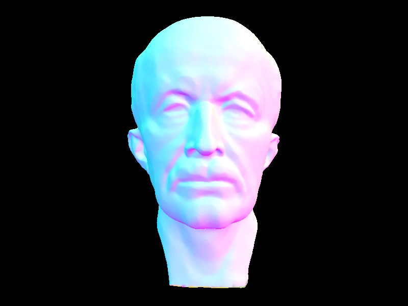

Assignment 3: PathTracer
====================
Author: Fanyu Meng

## Overview
In this project, we implemented a crude path tracer that can render simple objects. By implementing the `Ray` class and `intersect` functions in some primitives, we allow the camera ray to trace a light path and return the result. Using that abstraction, we implemented direct and indirect illumination, allowing the camera to find the color of a pixel with one bounce or multiple bounces. 

We also include several optimization methods. The first one is to organize the primitives using a hierarchical tree of bounding boxes, which allow us to skip many intersection test if the ray is not intersecting with the box; the second optimization is to incorporating adaptive sampling, stop generating rays if the pixel have already likely converged. 

## Part 1: Ray Generation and Scene Intersection

The structure of the rendering pipeline is:
1. For each sample per pixel, convert the 2D pixel coordinate into 3D ray direction from the camera to the sample location on the imaging plane;
2. Using a radiance calculating method, find the radiance of the given ray. First we find the first intersection on the path of the ray. By scanning through all primitives or scanning in a hierarchical order, we update the intersection point on the line to the first intersection;
3. Using the material BRDF and the reflecting direction of the intersection point, find the illumination of the ray on the given intersection.

The triangle intersection algorithm is basically a barycentric-coordinates test. Using the direction of the ray and the normal vector of the triangle, we can find the hitting point of the ray on the plane of the triangle. By finding the barycentric-coordinates w.r.t. to the triangle, we can apply a `point_in_triangle` test and find the distance of the hitting point of the ray from the camera. We then check if the point is valid (e.g. hitting point is behind the camera) and update the valid region of the ray. 

    <table width="100%" align="middle">
        <tr>
            <td align="middle">
                
                <figcaption align="middle"><code>CBspheres.dae</code> with normal shading.</figcaption>
            </td>
            <td align="middle">
                
                <figcaption align="middle"><code>CBcoil.dae</code> with normal shading.</figcaption>
            </td>
        </tr>
        <tr>
            <td align="middle">
                
                <figcaption align="middle"><code>bunny.dae</code> with normal shading.</figcaption>
            </td>
            <td align="middle">
                
                <figcaption align="middle"><code>dragon.dae</code> with normal shading.</figcaption>
            </td>
        </tr>
    </table>

## Part 2: Bounding Volume Hierarchy

We construct the bounding volume hierarchy (BVH) by recursively splitting the primitive list into two children. If the number of primitives is larger than `max_leaf_size`, we split the primitives using the heuristic of median, since it tries to split the primitives into two part with same number of items in both children. Then we recursively call the construction function on the two splitted list. If the number is small enough, we create a leaf node with the list of primitives in the node. This gives us the hierarchical tree of primitives we want.

If we want to do an intersection test on a BVH node, we first test if the ray intersects with the bounding box of the node. If not, we can safely assert that the ray does not intersect with any of the primitives in the node. If intersects, if the is a leaf node, we find the minimum intersection point w.r.t. each of the primitives in the node; otherwise, we find the minimum intersection w.r.t the two child nodes, if exists.

    <table width="100%" align="middle">
        <tr>
            <td align="middle">
                
                <figcaption align="middle"><code>maxplanck.dae</code>, 0.0633s BVH build time, 0.0713s rendering time.</figcaption>
            </td>
            <td align="middle">
                
                <figcaption align="middle"><code>CBlucy.dae</code>, 0.2317s BVH build time, 0.0588s rendering time.</figcaption>
            </td>
        </tr>
    </table>

## Part 3: Direct Illumination

## Part 4: Global Illumination

## Part 5: Adaptive Sampling

